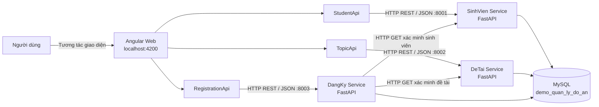
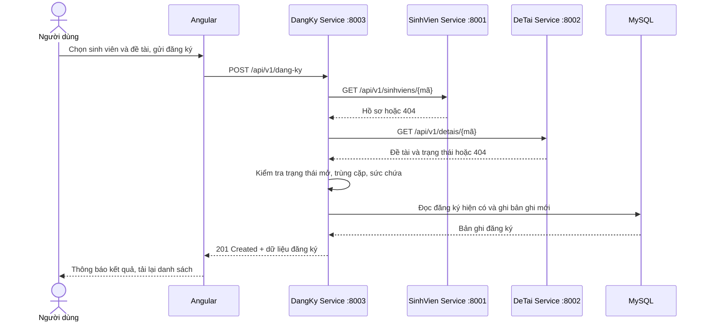

# Kiến trúc SOA — Hệ thống quản lý đồ án tốt nghiệp

Tài liệu mô tả kiến trúc và các luồng nghiệp vụ của ứng dụng quản lý sinh viên, đề tài tốt nghiệp và đăng ký đề tài. Nội dung phản ánh cách mã nguồn hiện tại được tổ chức và vận hành, phù hợp để trình bày trong buổi báo cáo.

## 1. Tổng quan

Hệ thống áp dụng **Service-Oriented Architecture (SOA)** ở mức ứng dụng: chức năng được chia thành ba dịch vụ nghiệp vụ có endpoint REST riêng, giao tiếp qua HTTP/JSON. Giao diện Angular đóng vai trò client; các dịch vụ backend viết bằng FastAPI; MySQL lưu dữ liệu dùng chung.

Ba dịch vụ là:

| Dịch vụ | Trách nhiệm | Cổng mặc định |
| --- | --- | ---: |
| SinhVien Service | Quản lý hồ sơ sinh viên | 8001 |
| DeTai Service | Quản lý đề tài tốt nghiệp | 8002 |
| DangKy Service | Quản lý và kiểm tra đăng ký đề tài | 8003 |

Mỗi dịch vụ là một tiến trình FastAPI độc lập. Các tiến trình được tạo từ cùng codebase và được chọn phạm vi route bằng biến môi trường `SERVICE_NAME` (`sinhvien`, `detai`, `dangky`). Vì vậy đây là SOA theo ranh giới nghiệp vụ và triển khai nhiều tiến trình, chưa phải ba codebase độc lập.

## 2. Sơ đồ kiến trúc



**Cách đọc sơ đồ:** người dùng thao tác trên Angular; mỗi Angular API service gọi dịch vụ tương ứng. Khi tạo đăng ký, DangKy Service gọi hai dịch vụ danh mục để xác minh đối tượng, sau đó thực hiện quy tắc nghiệp vụ và lưu bản ghi.

## 3. Thành phần và trách nhiệm

### Frontend — Angular

- Các màn hình được chia thành component: tổng quan, quản lý sinh viên, quản lý đề tài, quản lý đăng ký và điều hướng.
- `App` điều phối trạng thái màn hình, gọi API, làm mới dữ liệu và hiển thị thông báo thành công/lỗi.
- `StudentApi`, `TopicApi`, `RegistrationApi` đóng gói các lời gọi HTTP bằng Angular `HttpClient`; component không truy cập MySQL.
- `models.ts` định nghĩa kiểu dữ liệu phía client tương ứng với các đối tượng API.
- Ba endpoint mặc định được khai báo tại `fe/src/app/services/` và trỏ lần lượt đến cổng 8001, 8002, 8003.

### Backend — FastAPI

Các tiến trình dùng chung ứng dụng và router trong `be/app`, nhưng chỉ công bố nhóm route thuộc dịch vụ đã chọn:

- **SinhVien Service:** CRUD hồ sơ sinh viên, tìm kiếm theo mã hoặc họ tên.
- **DeTai Service:** CRUD đề tài, tìm kiếm theo mã hoặc tên.
- **DangKy Service:** liệt kê/lọc đăng ký, tạo đăng ký và hủy đăng ký.

Trong mỗi dịch vụ, luồng xử lý được tách thành các lớp:

1. `routers/api.py` nhận request HTTP, áp dụng dependency và trả response/status code.
2. `schemas/entities.py` xác thực dữ liệu vào và định dạng dữ liệu trả về bằng Pydantic.
3. `services/catalog.py` và `services/registration.py` chứa xử lý nghiệp vụ.
4. `models/entities.py` ánh xạ bảng MySQL bằng SQLAlchemy ORM.
5. `database/connection.py` tạo engine/session và cung cấp session cho request.

Thư mục `repositories` hiện chưa có lớp truy cập dữ liệu riêng; một số truy vấn được thực hiện trực tiếp bằng SQLAlchemy trong router hoặc service. Có thể nêu điểm này khi phân biệt kiến trúc đang triển khai với mô hình phân tầng mục tiêu.

### Cơ sở dữ liệu — MySQL

Cơ sở dữ liệu `demo_quan_ly_do_an` có ba bảng chính: `SINHVIEN`, `DETAI`, `DANGKY`. Các tiến trình backend cùng kết nối đến một database thông qua `DATABASE_URL`.

| Bảng | Dữ liệu chính | Ràng buộc đáng chú ý |
| --- | --- | --- |
| `SINHVIEN` | Mã, họ tên, email, lớp, ngành, điện thoại | Mã chính; email duy nhất nếu có |
| `DETAI` | Mã, tên, mô tả, giảng viên, sức chứa, trạng thái | Sức chứa lớn hơn 0; trạng thái mở/đóng |
| `DANGKY` | ID, mã sinh viên, mã đề tài, ngày, trạng thái | FK đến hai bảng; duy nhất theo cặp sinh viên–đề tài |

Khóa ngoại dùng `ON DELETE RESTRICT`, do đó không thể xóa sinh viên hoặc đề tài đang được tham chiếu bởi đăng ký. Hủy đăng ký chỉ chuyển trạng thái sang `DA_HUY`, không xóa bản ghi. Ràng buộc unique hiện vẫn giữ cặp mã, vì vậy cặp sinh viên–đề tài đã hủy không thể đăng ký lại.

## 4. Giao tiếp dịch vụ và API

Các API dùng REST qua HTTP, payload JSON, tiền tố phiên bản `/api/v1`. FastAPI cung cấp tài liệu tương tác Swagger tại `/docs` và kiểm tra tình trạng tại `/health`.

| Nghiệp vụ | Endpoint tiêu biểu | Dịch vụ |
| --- | --- | --- |
| Danh sách/tạo sinh viên | `GET/POST /api/v1/sinhviens` | SinhVien |
| Chi tiết/cập nhật/xóa sinh viên | `GET/PUT/DELETE /api/v1/sinhviens/{ma_sinh_vien}` | SinhVien |
| Danh sách/tạo đề tài | `GET/POST /api/v1/detais` | DeTai |
| Chi tiết/cập nhật/xóa đề tài | `GET/PUT/DELETE /api/v1/detais/{ma_de_tai}` | DeTai |
| Danh sách/lọc đăng ký | `GET /api/v1/dang-ky` | DangKy |
| Tạo/hủy đăng ký | `POST /api/v1/dang-ky`, `DELETE /api/v1/dang-ky/{id}` | DangKy |

Các thao tác xóa đăng ký sử dụng `DELETE` như một lệnh nghiệp vụ nhưng giữ bản ghi và cập nhật trạng thái hủy. Lỗi thường được biểu diễn qua mã HTTP: 404 khi không tìm thấy dữ liệu, 409 khi vi phạm quy tắc/ràng buộc, 422 khi request không hợp lệ, 503 khi dịch vụ phụ thuộc không khả dụng và 502 khi dịch vụ phụ thuộc trả lỗi.

## 5. Luồng nghiệp vụ tạo đăng ký



Các quy tắc trước khi tạo:

1. Sinh viên và đề tài phải tồn tại (xác minh qua API của dịch vụ sở hữu dữ liệu).
2. Đề tài phải ở trạng thái `MO_DANG_KY`.
3. Không tạo đăng ký trùng cho cùng sinh viên và đề tài.
4. Số đăng ký đang hoạt động không vượt `so_luong_toi_da`.
5. Database tiếp tục bảo vệ toàn vẹn bằng khóa ngoại và unique constraint trong trường hợp có request đồng thời.

Hủy đăng ký cập nhật `trang_thai` thành `DA_HUY`. Bản ghi lịch sử vẫn được giữ lại.

## 6. Cấu hình và triển khai cục bộ

- Frontend phát triển mặc định tại `http://localhost:4200`.
- Backend chạy thành ba tiến trình Uvicorn trên cổng 8001–8003.
- Mỗi tiến trình đọc `SERVICE_NAME`; DangKy Service đọc thêm `SINHVIEN_SERVICE_URL`, `DETAI_SERVICE_URL` để gọi hai dịch vụ phụ thuộc.
- `DATABASE_URL` cấu hình kết nối MySQL; cấu hình được nạp từ biến môi trường hoặc `be/.env`.
- CORS mặc định cho phép hai origin localhost của frontend; có thể tùy chỉnh qua `CORS_ORIGINS`.
- Health endpoint kiểm tra kết nối database và trả trạng thái dịch vụ.

Đây là mô hình triển khai phục vụ thực hành/trình diễn trên một máy. Các dịch vụ có thể khởi động độc lập, nhưng hiện vẫn phụ thuộc vào cùng database và kết nối đồng bộ trực tiếp qua HTTP.

## 7. Đặc điểm kiến trúc, lợi ích và giới hạn hiện tại

**Đặc điểm / lợi ích:**

- Chia trách nhiệm theo miền nghiệp vụ Sinh viên, Đề tài và Đăng ký.
- API có hợp đồng rõ ràng, có thể được gọi bởi frontend hoặc client khác.
- Các tiến trình backend độc lập về vòng đời khởi động; có thể cấu hình endpoint dịch vụ phụ thuộc.
- Logic đăng ký tập trung ở DangKy Service, nơi phối hợp xác minh danh mục và áp dụng quy tắc nghiệp vụ.
- Pydantic, SQLAlchemy và constraint trong MySQL giúp xác thực và bảo vệ dữ liệu ở nhiều lớp.

**Giới hạn cần trình bày chính xác:**

- Các dịch vụ dùng chung một schema/database MySQL; đây chưa phải mô hình database-per-service. Điều này đơn giản hóa triển khai demo nhưng làm tăng liên kết dữ liệu giữa các dịch vụ.
- Các dịch vụ được chọn route từ chung một codebase, chưa được đóng gói/phát hành như các sản phẩm độc lập.
- Giao tiếp DangKy → SinhVien/DeTai là HTTP đồng bộ. Nếu một dịch vụ danh mục không sẵn sàng, tạo đăng ký có thể thất bại; timeout hiện đặt 3 giây.
- Kiểm tra sức chứa và ghi đăng ký hiện là các bước đọc rồi ghi riêng, chưa có khóa/transaction phân tán để chống vượt sức chứa dưới tải đồng thời cao.
- Cấu hình endpoint API frontend đang khai báo trực tiếp trong các Angular service; triển khai nhiều môi trường sẽ thuận tiện hơn nếu chuyển sang cấu hình môi trường/API gateway.
- Chưa thấy thành phần API Gateway, xác thực/phân quyền, message broker, service discovery hoặc cơ chế retry/circuit breaker trong mã nguồn hiện tại.

## 8. Đối chiếu các nguyên lý SOA

Mục này đối chiếu các nguyên lý cốt lõi của Kiến trúc Hướng Dịch vụ (SOA) **đã được triển khai cụ thể trong mã nguồn** của dự án. Các nguyên lý lý thuyết chưa được áp dụng (như Giao tiếp bất đồng bộ qua hàng đợi / Message Broker, Tự động dò tìm dịch vụ lúc chạy - Service Discovery Registry, hay Tự phục hồi nâng cao - Circuit Breaker) không được đưa vào đây nhằm đảm bảo tính chính xác và bám sát mã nguồn thực tế.

| Nguyên lý SOA | Đánh giá hiện trạng | Bằng chứng mã nguồn chính | Tác động thực tế trong dự án |
| :--- | :--- | :--- | :--- |
| **1. Standardized Service Contract**<br/>*(Hợp đồng dịch vụ chuẩn hóa)* | Triển khai đầy đủ | `be/app/schemas/entities.py`<br/>`be/app/routers/api.py` | Toàn bộ dữ liệu vào/ra được chuẩn hóa bằng Pydantic schemas, REST API và tài liệu OpenAPI/Swagger. |
| **2. Service Loose Coupling**<br/>*(Liên kết lỏng giữa các dịch vụ)* | Triển khai ở mức giao tiếp | `be/app/services/registration.py` (`verify`)<br/>`be/app/core/config.py` | `DangKy` gọi `SinhVien` và `DeTai` qua HTTP REST độc lập; không import model hay gọi hàm Python trực tiếp của nhau; URL nạp qua biến môi trường. |
| **3. Service Abstraction**<br/>*(Trừu tượng hóa dịch vụ)* | Triển khai đầy đủ | `be/app/routers/api.py`<br/>`be/app/services/registration.py` | Ẩn toàn bộ logic nghiệp vụ, cấu trúc bảng MySQL và câu lệnh SQLAlchemy ORM đằng sau các endpoint REST API. |
| **4. Service Reusability**<br/>*(Tái sử dụng dịch vụ)* | Triển khai ở mức API công bố | `be/app/routers/api.py`<br/>`fe/src/app/services/*-api.ts` | Các dịch vụ cung cấp API CRUD dùng chung; quy tắc nghiệp vụ tập trung ở backend để mọi client (Web, Mobile, Test tool) có thể tái sử dụng. |
| **5. Service Composability**<br/>*(Khả năng hợp thành dịch vụ)* | Triển khai cụ thể | `be/app/services/registration.py` (`create_registration`) | `DangKy Service` đóng vai trò Composite Service, điều phối và xác thực dữ liệu từ hai dịch vụ thành phần (`SinhVien` và `DeTai`) để hoàn tất quy trình đăng ký. |
| **6. Service Autonomy**<br/>*(Tính tự chủ dịch vụ)* | Triển khai ở mức tiến trình runtime | `be/app/routers/api.py` (`SERVICE_NAME`)<br/>`be/app/main.py` | Ba dịch vụ chạy trên 3 tiến trình độc lập (:8001, :8002, :8003), tự quản lý tập route và vòng đời hoạt động riêng. |
| **7. Service Interoperability**<br/>*(Khả năng cộng tác / tương thích)* | Triển khai đầy đủ | Frontend Angular (TypeScript)<br/>Backend FastAPI (Python) | Hai công nghệ và ngôn ngữ khác nhau giao tiếp trơn tru thông qua các chuẩn giao thức mở: HTTP/1.1 và định dạng JSON. |

---

### 8.1. Hợp đồng dịch vụ chuẩn hóa (Standardized Service Contract)

- **Nguyên tắc:** Các dịch vụ xuất bản một hợp đồng giao tiếp chính thức, quy định rõ ràng định dạng dữ liệu, phương thức truy cập và ràng buộc kiểu để client và các dịch vụ khác tương tác mà không bị sai lệch.
- **Mã nguồn thực tế:**
  1. **Định nghĩa Schema chuẩn hóa bằng Pydantic** trong [be/app/schemas/entities.py](file:///d:/demo_crud_fastapi/be/app/schemas/entities.py#L9-L25):
     ```python
     class SinhVienInput(BaseModel):
         ma_sinh_vien: str = Field(min_length=1, max_length=20)
         ho_ten: str = Field(min_length=1, max_length=100)
         email: str | None = Field(default=None, max_length=255)
         lop: str | None = Field(default=None, max_length=50)
         nganh: str | None = Field(default=None, max_length=100)
         so_dien_thoai: str | None = Field(default=None, max_length=20)

     class SinhVienOut(ORMModel):
         ma_sinh_vien: str
         ho_ten: str
         email: str | None
         lop: str | None
         nganh: str | None
         so_dien_thoai: str | None
     ```
  2. **Ràng buộc hợp đồng tại Router bằng `response_model`** trong [be/app/routers/api.py](file:///d:/demo_crud_fastapi/be/app/routers/api.py#L14-L25):
     ```python
     @api.get("/sinhviens", response_model=list[SinhVienOut], tags=["SinhVien Service"])
     def sinhviens(q: str | None = None, db: Session = Depends(get_db)):
         return catalog.list_sinhvien(db, q)

     @api.post("/sinhviens", response_model=SinhVienOut, status_code=201, tags=["SinhVien Service"])
     def create_sinhvien(data: SinhVienInput, db: Session = Depends(get_db)):
         return catalog.save_sinhvien(db, data.model_dump())
     ```
  3. **Tài liệu hóa hợp đồng tự động:** FastAPI tự động phân tích các Pydantic Schemas và Routers để tạo tài liệu OpenAPI 3.0 và Swagger UI tại `/docs`, cho phép các consumer kiểm tra đặc tả hợp đồng API trực tiếp.

---

### 8.2. Liên kết lỏng (Service Loose Coupling)

- **Nguyên tắc:** Giảm thiểu sự phụ thuộc trực tiếp giữa các dịch vụ. Khi một dịch vụ cần dữ liệu của dịch vụ khác, nó tương tác qua giao thức chuẩn (HTTP REST), không phụ thuộc vào mã nguồn nội bộ hay lời gọi hàm trong cùng bộ nhớ.
- **Mã nguồn thực tế:**
  1. **Giao tiếp qua HTTP REST thay vì gọi hàm Python** trong [be/app/services/registration.py](file:///d:/demo_crud_fastapi/be/app/services/registration.py#L11-L20):
     ```python
     def verify(url: str, resource: str, key: str):
         try:
             response = httpx.get(f"{url}/{resource}/{key}", timeout=3.0)
         except httpx.RequestError as exc:
             raise HTTPException(503, f"Dịch vụ {resource} hiện không khả dụng") from exc
         if response.status_code == 404:
             raise HTTPException(404, f"Không tìm thấy {resource}")
         if response.is_error:
             raise HTTPException(502, f"Dịch vụ {resource} phản hồi lỗi")
         return response.json()
     ```
  2. **Tách biệt địa chỉ dịch vụ qua biến môi trường** trong [be/app/core/config.py](file:///d:/demo_crud_fastapi/be/app/core/config.py#L13-L15):
     ```python
     SINHVIEN_SERVICE_URL = os.getenv("SINHVIEN_SERVICE_URL", "http://127.0.0.1:8001/api/v1")
     DETAI_SERVICE_URL = os.getenv("DETAI_SERVICE_URL", "http://127.0.0.1:8002/api/v1")
     ```
  - **Tác động:** Dịch vụ Đăng ký (`DangKy`) không hề `import` các hàm của module `catalog.py` hay bảng `SinhVien`, `DeTai`. Địa chỉ IP/Port của các dịch vụ phụ thuộc có thể thay đổi linh hoạt qua cấu hình môi trường mà không cần sửa code.

---

### 8.3. Trừu tượng hóa dịch vụ (Service Abstraction)

- **Nguyên tắc:** Dịch vụ chỉ phơi bày giao diện công khai (REST endpoints và dữ liệu JSON đầu vào/ra), ẩn giấu hoàn toàn logic tính toán nội bộ, công nghệ lưu trữ dữ liệu (SQLAlchemy, MySQL) và chi tiết cài đặt.
- **Mã nguồn thực tế:**
  1. **Client chỉ nhìn thấy endpoint và schema đơn giản** trong [be/app/routers/api.py](file:///d:/demo_crud_fastapi/be/app/routers/api.py#L71-L73):
     ```python
     @api.post("/dang-ky", response_model=DangKyOut, status_code=201, tags=["DangKy Service"])
     def create_dangky(data: DangKyInput, db: Session = Depends(get_db)):
         return registration.create_registration(db, data.ma_sinh_vien, data.ma_de_tai)
     ```
  2. **Toàn bộ logic nghiệp vụ, câu lệnh ORM và kiểm tra ràng buộc được đóng gói kín** trong [be/app/services/registration.py](file:///d:/demo_crud_fastapi/be/app/services/registration.py#L26-L46):
     ```python
     if topic["trang_thai"] != "MO_DANG_KY":
         raise HTTPException(409, "Đề tài đã đóng đăng ký")

     active_registration = db.scalar(
         select(DangKy).where(
             DangKy.ma_sinh_vien == student_key,
             DangKy.trang_thai == "DA_DANG_KY",
         )
     )
     if active_registration:
         raise HTTPException(409, "Sinh viên cần hủy đăng ký hiện tại trước khi đăng ký đề tài khác")

     count = db.scalar(select(func.count()).select_from(DangKy).where(
         DangKy.ma_de_tai == topic_key, DangKy.trang_thai == "DA_DANG_KY"
     ))
     if count >= topic["so_luong_toi_da"]:
         raise HTTPException(409, "Đề tài đã đủ số lượng sinh viên")
     ```
  - **Tác động:** Phía Angular Frontend hay các bên gọi API chỉ cần gửi mã sinh viên và mã đề tài; họ hoàn toàn không biết bên trong có bảng dữ liệu nào, truy vấn SQL ra sao hay số lượng sinh viên được đếm bằng cơ chế gì.

---

### 8.4. Khả năng tái sử dụng (Service Reusability)

- **Nguyên tắc:** Logic nghiệp vụ cốt lõi được xây dựng thành các dịch vụ độc lập, có thể tái sử dụng bởi nhiều ứng dụng, giao diện hoặc tiến trình khác nhau mà không cần cài đặt lại logic.
- **Mã nguồn thực tế:**
  1. **Các endpoint CRUD được phát hành độc lập** trong [be/app/routers/api.py](file:///d:/demo_crud_fastapi/be/app/routers/api.py#L14-L62) cung cấp đầy đủ các thao tác tìm kiếm, xem chi tiết, thêm, sửa, xóa cho SinhVien và DeTai.
  2. **Dịch vụ DangKy tái sử dụng trực tiếp API của SinhVien và DeTai** qua HTTP để phục vụ bước xác minh đăng ký:
     ```python
     # be/app/services/registration.py
     verify(SINHVIEN_SERVICE_URL, "sinhviens", student_key)
     topic = verify(DETAI_SERVICE_URL, "detais", topic_key)
     ```
  3. **Frontend Angular tái sử dụng các API này** thông qua service client trong [fe/src/app/services/student-api.ts](file:///d:/demo_crud_fastapi/fe/src/app/services/student-api.ts#L13-L26):
     ```typescript
     list(q?: string): Observable<SinhVien[]> {
       let params = new HttpParams();
       if (q) params = params.set('q', q);
       return this.http.get<SinhVien[]>(this.baseUrl, { params });
     }

     create(data: SinhVienInput): Observable<SinhVien> {
       return this.http.post<SinhVien>(this.baseUrl, data);
     }
     ```
  - **Tác động:** Bất kỳ client nào khác trong tương lai (ứng dụng di động, trang quản trị giáo vụ, script import dữ liệu) đều có thể gọi lại các API này mà không cần viết lại quy tắc kiểm tra ràng buộc.

---

### 8.5. Khả năng hợp thành dịch vụ (Service Composability)

- **Nguyên tắc:** Các dịch vụ hạt nhân đơn lẻ (Atomic Services) có thể được kết hợp và điều phối để tạo thành một dịch vụ phức hợp (Composite Service) giải quyết bài toán nghiệp vụ quy mô lớn hơn.
- **Mã nguồn thực tế:**
  - `DangKy Service` đóng vai trò **Composite Service** điều phối quy trình đăng ký đề tài phức hợp trong [be/app/services/registration.py](file:///d:/demo_crud_fastapi/be/app/services/registration.py#L23-L44):
    ```python
    def create_registration(db: Session, student_key: str, topic_key: str):
        # 1. Điều phối tới Atomic Service SinhVien: Kiểm tra sinh viên tồn tại
        verify(SINHVIEN_SERVICE_URL, "sinhviens", student_key)

        # 2. Điều phối tới Atomic Service DeTai: Lấy thông tin & trạng thái đề tài
        topic = verify(DETAI_SERVICE_URL, "detais", topic_key)

        # 3. Tổng hợp kết quả & thực thi nghiệp vụ đăng ký
        if topic["trang_thai"] != "MO_DANG_KY":
            raise HTTPException(409, "Đề tài đã đóng đăng ký")
        ...
        record = DangKy(ma_sinh_vien=student_key, ma_de_tai=topic_key)
        db.add(record)
        db.commit()
        return record
    ```
  - **Tác động:** Nghiệp vụ "Đăng ký đề tài" không tự quản lý dữ liệu sinh viên hay đề tài mà hợp thành (compose) dữ liệu từ hai dịch vụ danh mục độc lập để hoàn tất một giao dịch kinh doanh.

---

### 8.6. Tính tự chủ dịch vụ (Service Autonomy)

- **Nguyên tắc:** Mỗi dịch vụ kiểm soát phạm vi và quyền hạn thực thi của riêng mình, chạy như một tiến trình runtime độc lập và có thể quản lý vòng đời mà không ảnh hưởng tới tiến trình khác.
- **Mã nguồn thực tế:**
  1. **Lọc và cô lập route riêng biệt theo biến môi trường `SERVICE_NAME`** trong [be/app/routers/api.py](file:///d:/demo_crud_fastapi/be/app/routers/api.py#L85-L90):
     ```python
     if SERVICE_NAME == "sinhvien":
         api.routes[:] = [r for r in api.routes if "SinhVien Service" in getattr(r, "tags", [])]
     elif SERVICE_NAME == "detai":
         api.routes[:] = [r for r in api.routes if "DeTai Service" in getattr(r, "tags", [])]
     elif SERVICE_NAME == "dangky":
         api.routes[:] = [r for r in api.routes if "DangKy Service" in getattr(r, "tags", [])]
     ```
  2. **Triển khai độc lập trên 3 cổng tiến trình riêng biệt:**
     - **SinhVien Service**: Chạy trên Port `8001` (`$env:SERVICE_NAME="sinhvien"`)
     - **DeTai Service**: Chạy trên Port `8002` (`$env:SERVICE_NAME="detai"`)
     - **DangKy Service**: Chạy trên Port `8003` (`$env:SERVICE_NAME="dangky"`)
  - **Tác động:** Mỗi tiến trình runtime có thể được dừng, khởi động lại, reload cấu hình độc lập mà không làm tắt runtime của các dịch vụ còn lại.

---

### 8.7. Khả năng cộng tác / tương thích (Service Interoperability)

- **Nguyên tắc:** Dịch vụ có khả năng tương tác xuyên suốt giữa các nền tảng, kiến trúc máy tính và ngôn ngữ lập trình khác nhau thông qua việc áp dụng chuẩn công nghệ mở (Open Standards).
- **Mã nguồn thực tế:**
  1. **Phía Server (Python / FastAPI):** Tiếp nhận và phản hồi dữ liệu chuẩn JSON qua giao thức HTTP/1.1:
     ```python
     # be/app/routers/api.py
     @api.post("/dang-ky", response_model=DangKyOut, status_code=201)
     def create_dangky(data: DangKyInput, db: Session = Depends(get_db)):
         return registration.create_registration(db, data.ma_sinh_vien, data.ma_de_tai)
     ```
  2. **Phía Client (TypeScript / Angular 21):** Sử dụng `HttpClient` để gửi nhận dữ liệu JSON mà không cần bất kỳ module Python hay thư viện SQLAlchemy nào trong [fe/src/app/services/registration-api.ts](file:///d:/demo_crud_fastapi/fe/src/app/services/registration-api.ts#L17-L21):
     ```typescript
     create(data: DangKyInput): Observable<DangKy> {
       return this.http.post<DangKy>(this.baseUrl, data);
     }
     ```
  - **Tác động:** Sự tách biệt giữa Python (Backend) và TypeScript (Frontend) chứng minh tính cộng tác hoàn hảo: bất kỳ công nghệ nào hiểu HTTP và JSON (như Java, C#, Flutter, React, cURL) đều có thể tương tác với các dịch vụ này.

## 9. Hướng phát triển nếu mở rộng

Khi chuyển từ bản trình diễn sang triển khai thực tế, có thể cân nhắc: tách cấu hình và đóng gói theo từng service; quản lý migration/schema; thiết kế quyền sở hữu dữ liệu rõ hơn (hoặc database riêng kèm API/event); đưa endpoint qua API Gateway; bổ sung xác thực, logging/metrics/tracing; và dùng transaction/locking hoặc cơ chế đặt chỗ để kiểm soát sức chứa khi có tải đồng thời. Đây là hướng mở rộng, không phải thành phần đã có trong bản hiện tại.

## 10. Gợi ý trình bày ngắn

> “Ứng dụng chia nghiệp vụ thành ba REST service: SinhVien, DeTai và DangKy. Angular gọi từng service qua các API riêng. Khi đăng ký, DangKy Service xác minh sinh viên và đề tài qua HTTP, kiểm tra trạng thái, đăng ký trùng và sức chứa rồi lưu vào MySQL. Bản demo chạy ba tiến trình độc lập nhưng dùng chung codebase và database, nên thể hiện ranh giới SOA ở tầng dịch vụ; các giới hạn như shared database và giao tiếp đồng bộ là điểm có thể phát triển tiếp.”

## 11. Vị trí mã nguồn liên quan

- Khởi tạo ứng dụng, CORS, health check: `be/app/main.py`
- API và chọn route theo dịch vụ: `be/app/routers/api.py`
- Nghiệp vụ danh mục: `be/app/services/catalog.py`
- Nghiệp vụ đăng ký và gọi dịch vụ: `be/app/services/registration.py`
- Kết nối và session MySQL: `be/app/database/connection.py`
- ORM và schema request/response: `be/app/models/entities.py`, `be/app/schemas/entities.py`
- API client Angular: `fe/src/app/services/`
- Script schema/dữ liệu mẫu: `database.sql`

### 11.1. Cách lần theo code khi trình bày từng nguyên lý SOA

Khi thuyết minh hoặc báo cáo về kiến trúc SOA của dự án, có thể mở trực tiếp các file và dòng code sau đây để minh chứng:

1. **Standardized Service Contract (Hợp đồng chuẩn hóa):**
   - Mở [be/app/schemas/entities.py](file:///d:/demo_crud_fastapi/be/app/schemas/entities.py#L9-L25): Trình bày các Pydantic class (`SinhVienInput`, `SinhVienOut`, `DangKyInput`) quy định kiểu dữ liệu, độ dài và thuộc tính bắt buộc.
   - Mở [be/app/routers/api.py](file:///d:/demo_crud_fastapi/be/app/routers/api.py#L14-L25): Chỉ ra tham số `response_model` và cách FastAPI tự sinh tài liệu chuẩn OpenAPI tại `/docs`.

2. **Loose Coupling (Liên kết lỏng):**
   - Mở [be/app/services/registration.py](file:///d:/demo_crud_fastapi/be/app/services/registration.py#L11-L20): Chỉ ra hàm `verify` sử dụng `httpx.get` để gọi sang dịch vụ `SinhVien` và `DeTai` qua HTTP REST thay vì gọi hàm Python trong bộ nhớ.
   - Mở [be/app/core/config.py](file:///d:/demo_crud_fastapi/be/app/core/config.py#L13-L15): Cho thấy URL của dịch vụ phụ thuộc được nạp động từ biến môi trường.

3. **Service Abstraction (Trừu tượng hóa dịch vụ):**
   - Mở [be/app/routers/api.py](file:///d:/demo_crud_fastapi/be/app/routers/api.py#L71-L73): Cho thấy router chỉ tiếp nhận request và chuyển giao cho service.
   - Mở [be/app/services/registration.py](file:///d:/demo_crud_fastapi/be/app/services/registration.py#L26-L46): Cho thấy toàn bộ logic kiểm tra sức chứa, trùng lặp và truy vấn SQL/ORM đều được giấu kín sau endpoint.

4. **Service Reusability (Tái sử dụng dịch vụ):**
   - Mở [be/app/routers/api.py](file:///d:/demo_crud_fastapi/be/app/routers/api.py#L14-L62): Giới thiệu các API CRUD độc lập.
   - Mở [fe/src/app/services/student-api.ts](file:///d:/demo_crud_fastapi/fe/src/app/services/student-api.ts#L13-L26): Chỉ ra Angular tái sử dụng API này để thao tác dữ liệu mà không cần biết chi tiết cơ sở dữ liệu.

5. **Service Composability (Khả năng hợp thành dịch vụ):**
   - Mở [be/app/services/registration.py](file:///d:/demo_crud_fastapi/be/app/services/registration.py#L23-L44): Chỉ ra luồng của hàm `create_registration` khi điều phối (orchestration) hai lời gọi đến `SINHVIEN_SERVICE_URL` và `DETAI_SERVICE_URL` để hoàn tất quy trình nghiệp vụ tổng hợp.

6. **Service Autonomy (Tính tự chủ dịch vụ):**
   - Mở [be/app/routers/api.py](file:///d:/demo_crud_fastapi/be/app/routers/api.py#L85-L90): Chỉ ra đoạn code lọc route theo biến môi trường `$env:SERVICE_NAME` giúp tách thành 3 tiến trình độc lập trên 3 cổng `:8001`, `:8002`, `:8003`.

7. **Service Interoperability (Khả năng tương tác / cộng tác):**
   - So sánh giữa Frontend [fe/src/app/services/registration-api.ts](file:///d:/demo_crud_fastapi/fe/src/app/services/registration-api.ts) (TypeScript / Angular) và Backend [be/app/routers/api.py](file:///d:/demo_crud_fastapi/be/app/routers/api.py) (Python / FastAPI) giao tiếp trơn tru bằng chuẩn HTTP/REST + JSON.
