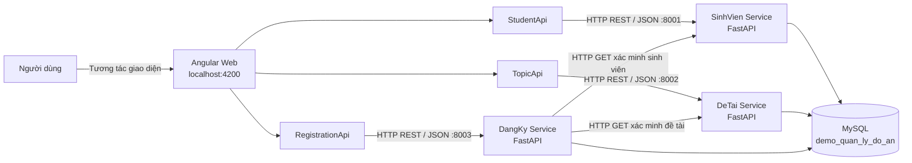
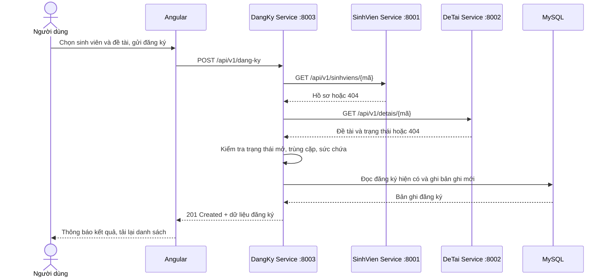

# Kiến trúc SOA — Hệ thống quản lý đồ án tốt nghiệp

Tài liệu mô tả kiến trúc và các luồng nghiệp vụ của ứng dụng quản lý sinh viên, đề tài tốt nghiệp và đăng ký đề tài. Nội dung phản ánh cách mã nguồn hiện tại được tổ chức và vận hành, phù hợp để trình bày trong buổi báo cáo.

## 1. Tổng quan

Hệ thống áp dụng **Service-Oriented Architecture (SOA)** ở mức ứng dụng: chức năng được chia thành ba dịch vụ nghiệp vụ có endpoint REST riêng, giao tiếp qua HTTP/JSON. Giao diện Angular đóng vai trò client; các dịch vụ backend viết bằng FastAPI; MySQL lưu dữ liệu dùng chung.

Ba dịch vụ là:

| Dịch vụ | Trách nhiệm | Cổng mặc định |
| --- | --- | ---: |
| SinhVien Service | Quản lý hồ sơ sinh viên | 8001 |
| DeTai Service | Quản lý đề tài tốt nghiệp | 8002 |
| DangKy Service | Quản lý và kiểm tra đăng ký đề tài | 8003 |

Mỗi dịch vụ là một tiến trình FastAPI độc lập. Các tiến trình được tạo từ cùng codebase và được chọn phạm vi route bằng biến môi trường `SERVICE_NAME` (`sinhvien`, `detai`, `dangky`). Vì vậy đây là SOA theo ranh giới nghiệp vụ và triển khai nhiều tiến trình, chưa phải ba codebase độc lập.

## 2. Sơ đồ kiến trúc

**Cách đọc sơ đồ:** người dùng thao tác trên Angular; mỗi Angular API service gọi dịch vụ tương ứng. Khi tạo đăng ký, DangKy Service gọi hai dịch vụ danh mục để xác minh đối tượng, sau đó thực hiện quy tắc nghiệp vụ và lưu bản ghi.

## 3. Thành phần và trách nhiệm

### Frontend — Angular

- Các màn hình được chia thành component: tổng quan, quản lý sinh viên, quản lý đề tài, quản lý đăng ký và điều hướng.
- `App` điều phối trạng thái màn hình, gọi API, làm mới dữ liệu và hiển thị thông báo thành công/lỗi.
- `StudentApi`, `TopicApi`, `RegistrationApi` đóng gói các lời gọi HTTP bằng Angular `HttpClient`; component không truy cập MySQL.
- `models.ts` định nghĩa kiểu dữ liệu phía client tương ứng với các đối tượng API.
- Ba endpoint mặc định được khai báo tại `fe/src/app/services/` và trỏ lần lượt đến cổng 8001, 8002, 8003.

### Backend — FastAPI

Các tiến trình dùng chung ứng dụng và router trong `be/app`, nhưng chỉ công bố nhóm route thuộc dịch vụ đã chọn:

- **SinhVien Service:** CRUD hồ sơ sinh viên, tìm kiếm theo mã hoặc họ tên.
- **DeTai Service:** CRUD đề tài, tìm kiếm theo mã hoặc tên.
- **DangKy Service:** liệt kê/lọc đăng ký, tạo đăng ký và hủy đăng ký.

Trong mỗi dịch vụ, luồng xử lý được tách thành các lớp:

1. `routers/api.py` nhận request HTTP, áp dụng dependency và trả response/status code.
2. `schemas/entities.py` xác thực dữ liệu vào và định dạng dữ liệu trả về bằng Pydantic.
3. `services/catalog.py` và `services/registration.py` chứa xử lý nghiệp vụ.
4. `models/entities.py` ánh xạ bảng MySQL bằng SQLAlchemy ORM.
5. `database/connection.py` tạo engine/session và cung cấp session cho request.

Thư mục `repositories` hiện chưa có lớp truy cập dữ liệu riêng; một số truy vấn được thực hiện trực tiếp bằng SQLAlchemy trong router hoặc service. Có thể nêu điểm này khi phân biệt kiến trúc đang triển khai với mô hình phân tầng mục tiêu.

### Cơ sở dữ liệu — MySQL

Cơ sở dữ liệu `demo_quan_ly_do_an` có ba bảng chính: `SINHVIEN`, `DETAI`, `DANGKY`. Các tiến trình backend cùng kết nối đến một database thông qua `DATABASE_URL`.

| Bảng | Dữ liệu chính | Ràng buộc đáng chú ý |
| --- | --- | --- |
| `SINHVIEN` | Mã, họ tên, email, lớp, ngành, điện thoại | Mã chính; email duy nhất nếu có |
| `DETAI` | Mã, tên, mô tả, giảng viên, sức chứa, trạng thái | Sức chứa lớn hơn 0; trạng thái mở/đóng |
| `DANGKY` | ID, mã sinh viên, mã đề tài, ngày, trạng thái | FK đến hai bảng; duy nhất theo cặp sinh viên–đề tài |

Khóa ngoại dùng `ON DELETE RESTRICT`, do đó không thể xóa sinh viên hoặc đề tài đang được tham chiếu bởi đăng ký. Hủy đăng ký chỉ chuyển trạng thái sang `DA_HUY`, không xóa bản ghi. Ràng buộc unique hiện vẫn giữ cặp mã, vì vậy cặp sinh viên–đề tài đã hủy không thể đăng ký lại.

## 4. Giao tiếp dịch vụ và API

Các API dùng REST qua HTTP, payload JSON, tiền tố phiên bản `/api/v1`. FastAPI cung cấp tài liệu tương tác Swagger tại `/docs` và kiểm tra tình trạng tại `/health`.

| Nghiệp vụ | Endpoint tiêu biểu | Dịch vụ |
| --- | --- | --- |
| Danh sách/tạo sinh viên | `GET/POST /api/v1/sinhviens` | SinhVien |
| Chi tiết/cập nhật/xóa sinh viên | `GET/PUT/DELETE /api/v1/sinhviens/{ma_sinh_vien}` | SinhVien |
| Danh sách/tạo đề tài | `GET/POST /api/v1/detais` | DeTai |
| Chi tiết/cập nhật/xóa đề tài | `GET/PUT/DELETE /api/v1/detais/{ma_de_tai}` | DeTai |
| Danh sách/lọc đăng ký | `GET /api/v1/dang-ky` | DangKy |
| Tạo/hủy đăng ký | `POST /api/v1/dang-ky`, `DELETE /api/v1/dang-ky/{id}` | DangKy |

Các thao tác xóa đăng ký sử dụng `DELETE` như một lệnh nghiệp vụ nhưng giữ bản ghi và cập nhật trạng thái hủy. Lỗi thường được biểu diễn qua mã HTTP: 404 khi không tìm thấy dữ liệu, 409 khi vi phạm quy tắc/ràng buộc, 422 khi request không hợp lệ, 503 khi dịch vụ phụ thuộc không khả dụng và 502 khi dịch vụ phụ thuộc trả lỗi.

## 5. Luồng nghiệp vụ tạo đăng ký

Các quy tắc trước khi tạo:

1. Sinh viên và đề tài phải tồn tại (xác minh qua API của dịch vụ sở hữu dữ liệu).
2. Đề tài phải ở trạng thái `MO_DANG_KY`.
3. Không tạo đăng ký trùng cho cùng sinh viên và đề tài.
4. Số đăng ký đang hoạt động không vượt `so_luong_toi_da`.
5. Database tiếp tục bảo vệ toàn vẹn bằng khóa ngoại và unique constraint trong trường hợp có request đồng thời.

Hủy đăng ký cập nhật `trang_thai` thành `DA_HUY`. Bản ghi lịch sử vẫn được giữ lại.

## 6. Cấu hình và triển khai cục bộ

- Frontend phát triển mặc định tại `http://localhost:4200`.
- Backend chạy thành ba tiến trình Uvicorn trên cổng 8001–8003.
- Mỗi tiến trình đọc `SERVICE_NAME`; DangKy Service đọc thêm `SINHVIEN_SERVICE_URL`, `DETAI_SERVICE_URL` để gọi hai dịch vụ phụ thuộc.
- `DATABASE_URL` cấu hình kết nối MySQL; cấu hình được nạp từ biến môi trường hoặc `be/.env`.
- CORS mặc định cho phép hai origin localhost của frontend; có thể tùy chỉnh qua `CORS_ORIGINS`.
- Health endpoint kiểm tra kết nối database và trả trạng thái dịch vụ.

Đây là mô hình triển khai phục vụ thực hành/trình diễn trên một máy. Các dịch vụ có thể khởi động độc lập, nhưng hiện vẫn phụ thuộc vào cùng database và kết nối đồng bộ trực tiếp qua HTTP.

## 7. Đặc điểm kiến trúc, lợi ích và giới hạn hiện tại

**Đặc điểm / lợi ích:**

- Chia trách nhiệm theo miền nghiệp vụ Sinh viên, Đề tài và Đăng ký.
- API có hợp đồng rõ ràng, có thể được gọi bởi frontend hoặc client khác.
- Các tiến trình backend độc lập về vòng đời khởi động; có thể cấu hình endpoint dịch vụ phụ thuộc.
- Logic đăng ký tập trung ở DangKy Service, nơi phối hợp xác minh danh mục và áp dụng quy tắc nghiệp vụ.
- Pydantic, SQLAlchemy và constraint trong MySQL giúp xác thực và bảo vệ dữ liệu ở nhiều lớp.

**Giới hạn cần trình bày chính xác:**

- Các dịch vụ dùng chung một schema/database MySQL; đây chưa phải mô hình database-per-service. Điều này đơn giản hóa triển khai demo nhưng làm tăng liên kết dữ liệu giữa các dịch vụ.
- Các dịch vụ được chọn route từ chung một codebase, chưa được đóng gói/phát hành như các sản phẩm độc lập.
- Giao tiếp DangKy → SinhVien/DeTai là HTTP đồng bộ. Nếu một dịch vụ danh mục không sẵn sàng, tạo đăng ký có thể thất bại; timeout hiện đặt 3 giây.
- Kiểm tra sức chứa và ghi đăng ký hiện là các bước đọc rồi ghi riêng, chưa có khóa/transaction phân tán để chống vượt sức chứa dưới tải đồng thời cao.
- Cấu hình endpoint API frontend đang khai báo trực tiếp trong các Angular service; triển khai nhiều môi trường sẽ thuận tiện hơn nếu chuyển sang cấu hình môi trường/API gateway.
- Chưa thấy thành phần API Gateway, xác thực/phân quyền, message broker, service discovery hoặc cơ chế retry/circuit breaker trong mã nguồn hiện tại.

## 8. Đối chiếu các nguyên lý SOA

Phần này đối chiếu từng nguyên lý với **hành vi có thể chỉ ra trong mã nguồn**, tác động khi chạy, và phần còn thiếu. “Có” trong bảng chỉ mức độ có bằng chứng thực thi; khả năng về lý thuyết của REST không được tính là tính năng đã triển khai.

| Nguyên lý | Đánh giá hiện trạng | Bằng chứng trực tiếp | Tác động / phần chưa đạt |
| --- | --- | --- | --- |
| Loose coupling — liên kết lỏng | Một phần | `DangKy` gọi hai URL REST riêng bằng `httpx.get`; router lọc route bằng `SERVICE_NAME`. | Có ranh giới giao tiếp HTTP, nhưng chung codebase và database; đăng ký vẫn cần cả hai service danh mục hoạt động. |
| Reusability — tái sử dụng dịch vụ | Có giao diện để tái sử dụng | Angular gọi các API riêng của SinhVien, DeTai, DangKy; quy tắc đăng ký nằm trong backend. | Chưa có bằng chứng client thứ hai đã sử dụng; mới chứng minh API được công bố, chưa chứng minh mức tái sử dụng thực tế. |
| Giao tiếp bất đồng bộ | Chưa áp dụng | `httpx.get` đợi phản hồi; endpoint FastAPI trả kết quả ngay cho request. | Phụ thuộc thời gian phản hồi của service khác; không có queue, broker hoặc event. |
| Quản lý chính sách | Một phần | CORS ở `main.py`; schema ở Pydantic; kiểm tra nghiệp vụ ở service; constraint ở MySQL. | Chưa thấy xác thực/phân quyền, rate limit, QoS, chính sách tập trung; CORS không bảo vệ API khỏi người gọi không được phép. |
| Khả năng cộng tác | Có ở mức giao thức | REST/HTTP, JSON, schema Pydantic/OpenAPI. | Có thể gọi bằng client khác ngôn ngữ; mã nguồn hiện chỉ thể hiện Angular và Python, chưa có tích hợp ngoài thực tế. |
| Tự động dò tìm và ràng buộc động | Có tài liệu API, chưa có discovery/binding tự động | FastAPI sinh OpenAPI/Swagger (`/docs`); URL phụ thuộc lấy từ biến môi trường. | Tài liệu API có thể xem được, nhưng không có registry/health-based discovery; frontend vẫn ghi URL cố định. |
| Tự hồi phục | Chưa áp dụng đầy đủ | `/health`, timeout 3 giây, ánh xạ lỗi phụ thuộc thành 502/503. | Chỉ phát hiện/giới hạn lỗi; không retry, circuit breaker, failover hoặc tự khởi động lại. |

### 8.1. Liên kết lỏng — Loose coupling (một phần)

**Mã đang làm gì:** `be/app/services/registration.py`, hàm `verify`, tạo URL dạng `{url}/{resource}/{key}` rồi gọi HTTP với timeout 3 giây. Khi tạo đăng ký, DangKy Service gọi `GET /sinhviens/{mã}` và `GET /detais/{mã}`. Nó không import model hay gọi hàm Python của hai dịch vụ danh mục để xác minh. Do đó giao kèo giữa chúng là URL, phương thức HTTP, JSON và mã trạng thái.

**Tác động:** có thể đổi cách cài đặt bên trong SinhVien Service mà không cần sửa DangKy, miễn là hợp đồng endpoint/response vẫn giữ nguyên. Nếu đổi URL, biến môi trường cho phép cấu hình lại địa chỉ backend phụ thuộc.

**Giới hạn cụ thể:** ba tiến trình vẫn dùng cùng codebase `be/app`; `SERVICE_NAME` chỉ lọc route trong `routers/api.py`. Cả ba còn dùng chung `DATABASE_URL` và schema nên thay đổi cấu trúc bảng có thể ảnh hưởng chéo. Hơn nữa, tạo đăng ký cần phản hồi của cả SinhVien và DeTai; service nào ngừng hoạt động thì request đăng ký lỗi. Kết luận: tách giao tiếp khỏi lời gọi hàm nội bộ, nhưng chưa tách triển khai và dữ liệu hoàn toàn.

### 8.2. Tái sử dụng dịch vụ — Reusability (đã có API, chưa chứng minh nhiều consumer)

**Mã đang làm gì:** Angular gọi cùng hợp đồng backend qua `fe/src/app/services/student-api.ts`, `topic-api.ts` và `registration-api.ts`. Ví dụ, `StudentApi` gửi `GET/POST/PUT/DELETE` tới `/api/v1/sinhviens`; nghiệp vụ kiểm tra trạng thái đề tài, trùng cặp và sức chứa chỉ nằm ở `registration.create_registration`.

**Tác động:** client khác có thể gọi các endpoint mà không sao chép quy tắc nghiệp vụ vào giao diện. Angular cũng không cần biết chi tiết kết nối MySQL.

**Giới hạn cụ thể:** trong dự án hiện chỉ có Angular làm client nhìn thấy được. Không có ứng dụng di động/đối tác thứ hai hoặc thống kê sử dụng. Vì vậy diễn đạt chính xác là “API đã được thiết kế/công bố để tái sử dụng”, không phải “đã được nhiều hệ thống tái sử dụng”.

### 8.3. Tự động dò tìm và ràng buộc động (có tài liệu API, chưa có discovery/binding tự động)

**Mã đang làm gì:** FastAPI cung cấp OpenAPI/Swagger tại `/docs`, giúp người phát triển xem endpoint, phương thức và schema; URL gọi chéo backend được nạp từ `SINHVIEN_SERVICE_URL` và `DETAI_SERVICE_URL` trong `be/app/core/config.py`.

**Tác động:** developer có thể khám phá hợp đồng API qua tài liệu; địa chỉ backend phụ thuộc có thể đổi theo môi trường mà không sửa hàm `verify`.

**Giới hạn cụ thể:** đây là khám phá tài liệu, không phải service discovery lúc chạy. Không thấy registry để đăng ký instance, tra cứu địa chỉ, kiểm tra instance sống hoặc cân bằng tải. Ba endpoint frontend còn ghi trực tiếp `localhost:8001/8002/8003` trong các Angular API client.

### 8.4. Khả năng cộng tác (có ở mức giao thức)

**Mã đang làm gì:** backend nhận HTTP và JSON; Pydantic khai báo cấu trúc dữ liệu và FastAPI xuất OpenAPI. Angular tiêu thụ những endpoint đó qua `HttpClient`.

**Tác động:** client không cần dùng Python hay SQLAlchemy; nếu tuân thủ HTTP, JSON và hợp đồng endpoint, client Java/C#/mobile có thể tích hợp.

**Giới hạn cụ thể:** đó là khả năng theo chuẩn giao tiếp, chưa phải bằng chứng đã kết nối hệ thống đa ngôn ngữ. Repository hiện không thể hiện consumer ngoài Angular hoặc đối tác legacy.

### 8.5. Giao tiếp bất đồng bộ (chưa áp dụng)

**Mã đang làm gì:** `httpx.get(...)` trong `verify` là lời gọi đồng bộ; hàm đợi từng phản hồi trước khi tiếp tục. Endpoint `POST /api/v1/dang-ky` chỉ trả `201` sau khi kiểm tra xong và ghi database.

**Tác động:** người dùng nhận kết quả ngay trong cùng request, phù hợp luồng demo cần biết đăng ký thành công hay thất bại. Đổi lại, thời gian chờ cộng dồn theo phản hồi của các service phụ thuộc.

**Giới hạn cụ thể:** không thấy queue, broker, publish/subscribe hoặc xử lý event nền. Đây là lựa chọn kiến trúc hiện tại, không phải một năng lực bất đồng bộ.

### 8.6. Quản lý chính sách (một phần, chưa tập trung)

**Mã đang làm gì:** `main.py` giới hạn origin bằng CORS; schema Pydantic kiểm tra kiểu và trường request; `registration.py` áp dụng quy tắc trạng thái, trùng và sức chứa; MySQL ràng buộc FK/unique; API dùng các mã lỗi HTTP để biểu diễn trường hợp lỗi.

**Tác động:** một số chính sách giao tiếp, hợp lệ dữ liệu và nghiệp vụ được thực thi ở đúng lớp tương ứng. Client nhận được phản hồi có thể xử lý thay vì chỉ nhận lỗi chung.

**Giới hạn cụ thể:** chưa thấy authentication/authorization (ai được tạo/xóa), policy engine hoặc nơi quản lý tập trung, giới hạn tốc độ/QoS, hay chính sách bảo mật xuyên các service. CORS chỉ quyết định trình duyệt nào được phép đọc phản hồi; nó không xác thực người dùng và không chặn mọi client HTTP.

### 8.7. Tự hồi phục (phát hiện lỗi có, phục hồi tự động chưa có)

**Mã đang làm gì:** `/health` trong `main.py` chạy `SELECT 1` để kiểm tra DB; `verify` giới hạn lời gọi phụ thuộc ở 3 giây. Lỗi kết nối chuyển thành 503, lỗi HTTP từ service phụ thuộc thành 502, còn 404 được giữ ý nghĩa “không tìm thấy”.

**Tác động:** client biết dependency nào đang lỗi và request không chờ vô hạn. Endpoint health giúp công cụ vận hành kiểm tra tình trạng backend/database.

**Giới hạn cụ thể:** trả mã lỗi là phát hiện/lan truyền lỗi, không phải tự khôi phục. Không thấy retry có backoff, circuit breaker, chuyển sang replica, hàng đợi lưu request để thử lại hoặc orchestrator khởi động lại tiến trình. Khi SinhVien/DeTai mất kết nối, đăng ký thất bại cho đến khi dependency hoạt động lại.

## 9. Hướng phát triển nếu mở rộng

Khi chuyển từ bản trình diễn sang triển khai thực tế, có thể cân nhắc: tách cấu hình và đóng gói theo từng service; quản lý migration/schema; thiết kế quyền sở hữu dữ liệu rõ hơn (hoặc database riêng kèm API/event); đưa endpoint qua API Gateway; bổ sung xác thực, logging/metrics/tracing; và dùng transaction/locking hoặc cơ chế đặt chỗ để kiểm soát sức chứa khi có tải đồng thời. Đây là hướng mở rộng, không phải thành phần đã có trong bản hiện tại.

## 10. Gợi ý trình bày ngắn

> “Ứng dụng chia nghiệp vụ thành ba REST service: SinhVien, DeTai và DangKy. Angular gọi từng service qua các API riêng. Khi đăng ký, DangKy Service xác minh sinh viên và đề tài qua HTTP, kiểm tra trạng thái, đăng ký trùng và sức chứa rồi lưu vào MySQL. Bản demo chạy ba tiến trình độc lập nhưng dùng chung codebase và database, nên thể hiện ranh giới SOA ở tầng dịch vụ; các giới hạn như shared database và giao tiếp đồng bộ là điểm có thể phát triển tiếp.”

## 11. Vị trí mã nguồn liên quan

- Khởi tạo ứng dụng, CORS, health check: `be/app/main.py`
- API và chọn route theo dịch vụ: `be/app/routers/api.py`
- Nghiệp vụ danh mục: `be/app/services/catalog.py`
- Nghiệp vụ đăng ký và gọi dịch vụ: `be/app/services/registration.py`
- Kết nối và session MySQL: `be/app/database/connection.py`
- ORM và schema request/response: `be/app/models/entities.py`, `be/app/schemas/entities.py`
- API client Angular: `fe/src/app/services/`
- Script schema/dữ liệu mẫu: `database.sql`

### 11.1. Cách lần theo code khi trình bày từng nguyên lý SOA

Các vị trí dưới đây tính theo số dòng của file hiện tại. Có thể mở file theo link, lần theo luồng request vào router → xử lý nghiệp vụ → gọi HTTP/truy cập dữ liệu → response.

#### Loose coupling — liên kết lỏng

- **Chọn nhóm API được cung cấp:** [be/app/routers/api.py](be/app/routers/api.py#L11) khai báo tiền tố `/api/v1`; các route được gắn tag SinhVien, DeTai hoặc DangKy. Cuối file, dòng 85–90 giữ lại nhóm route khớp `SERVICE_NAME`. Cùng ứng dụng do đó có thể chạy với phạm vi API khác nhau theo cấu hình.
- **Gọi qua hợp đồng HTTP:** [be/app/services/registration.py](be/app/services/registration.py#L11) định nghĩa `verify`. Dòng 13 ghép URL, resource và key rồi gọi `httpx.get` với timeout 3 giây. Dòng 16–20 chuyển 404 thành “không tìm thấy”, lỗi HTTP khác thành 502 và trả JSON nếu thành công. Dòng 24–25 gọi lần lượt API sinh viên và đề tài.
- **Cấu hình địa chỉ:** [be/app/core/config.py](be/app/core/config.py#L13)–[14](be/app/core/config.py#L14) lấy URL phụ thuộc từ biến môi trường, có giá trị mặc định.
- **Diễn tiến:** POST đăng ký → router gọi hàm nghiệp vụ → DangKy gọi hai API bằng HTTP → kiểm tra JSON → ghi đăng ký. DangKy không gọi trực tiếp hàm Python của catalog để xác minh.
- **Giới hạn:** [api.py](be/app/routers/api.py#L7) import cả ba ORM model và [connection.py](be/app/database/connection.py#L11) tạo engine dùng `DATABASE_URL`; giao tiếp được tách qua HTTP nhưng codebase và database vẫn dùng chung.

#### Reusability — tái sử dụng dịch vụ

- **API được công bố:** [be/app/routers/api.py](be/app/routers/api.py#L14)–[37](be/app/routers/api.py#L37) khai báo CRUD sinh viên; dòng 39–62 khai báo CRUD đề tài; dòng 64–82 khai báo đọc, tạo và hủy đăng ký.
- **Client hiện có:** [student-api.ts](fe/src/app/services/student-api.ts#L9)–[27](fe/src/app/services/student-api.ts#L27) bọc lời gọi HTTP sinh viên. `topic-api.ts` và `registration-api.ts` làm tương tự cho hai API còn lại. `list()` gọi GET, `create()` gọi POST, `update()` gọi PUT.
- **Nghiệp vụ ở backend:** [api.py](be/app/routers/api.py#L71)–[73](be/app/routers/api.py#L73) chuyển request đăng ký vào `registration.create_registration`; component Angular không tự áp dụng các quy tắc này.
- **Diễn tiến:** client gửi request theo hợp đồng REST → backend xử lý → client nhận dữ liệu hoặc mã lỗi. Client khác có thể gọi cùng endpoint mà không chép lại quy tắc nghiệp vụ.
- **Giới hạn:** repository chỉ cho thấy Angular là consumer; chưa có bằng chứng client thứ hai thực sự gọi API. Kết luận phù hợp là “API có thể tái sử dụng”.

#### Tự động dò tìm và ràng buộc động

- [be/app/main.py](be/app/main.py#L9) khởi tạo FastAPI; FastAPI tạo OpenAPI và Swagger mặc định tại `/docs`. Các route và `response_model` ở [api.py](be/app/routers/api.py#L14)–[82](be/app/routers/api.py#L82) cung cấp thông tin endpoint/schema cho tài liệu.
- [config.py](be/app/core/config.py#L13)–[15](be/app/core/config.py#L15) đọc URL dịch vụ và tên service từ môi trường; [registration.py](be/app/services/registration.py#L23)–[25](be/app/services/registration.py#L25) dùng URL đó khi chạy.
- **Diễn tiến:** developer xem hợp đồng trên Swagger; khi khởi động backend, cấu hình môi trường quyết định tên service và URL dependency.
- **Giới hạn:** đây không phải service discovery. Không có registry chọn instance khỏe; URL frontend được ghi cố định, ví dụ [student-api.ts](fe/src/app/services/student-api.ts#L11). Topic và registration client cũng khai báo URL theo cách tương tự.

#### Khả năng cộng tác — interoperability

- **Hợp đồng dữ liệu:** [be/app/schemas/entities.py](be/app/schemas/entities.py#L9)–[16](be/app/schemas/entities.py#L16) mô tả dữ liệu vào sinh viên; dòng 18–24 mô tả dữ liệu trả về. `DeTaiInput/Out` và `DangKyInput/Out` được khai báo tiếp theo. `Field` nêu kiểu và giới hạn dữ liệu.
- **Hợp đồng giao tiếp:** route ở [api.py](be/app/routers/api.py#L14)–[82](be/app/routers/api.py#L82) dùng HTTP và response model; Angular dùng `HttpClient`, ví dụ [student-api.ts](fe/src/app/services/student-api.ts#L13)–[26](fe/src/app/services/student-api.ts#L26).
- **Diễn tiến:** client gửi HTTP/JSON đúng schema, rồi đọc JSON/status code; không cần dùng Python, SQLAlchemy hay truy cập MySQL.
- **Giới hạn:** client Java, C# hoặc mobile là khả năng từ hợp đồng giao tiếp, chưa phải tích hợp đã có trong repository.

#### Giao tiếp bất đồng bộ

- [registration.py](be/app/services/registration.py#L11)–[20](be/app/services/registration.py#L20) dùng `httpx.get` đồng bộ. `create_registration` gọi verify sinh viên rồi verify đề tài ở dòng 24–25; sau đó mới kiểm tra nghiệp vụ và commit ở dòng 26–37. Router [api.py](be/app/routers/api.py#L71)–[73](be/app/routers/api.py#L73) trả kết quả trong request POST.
- **Diễn tiến:** request chờ service sinh viên phản hồi, tiếp đó chờ service đề tài, rồi mới trả kết quả. Timeout giới hạn thời gian chờ mỗi lần gọi.
- **Kết luận:** chưa thấy queue, broker, event hay tác vụ nền trong luồng này; hệ thống đang giao tiếp đồng bộ.

#### Quản lý chính sách

- **Origin trình duyệt:** [be/app/main.py](be/app/main.py#L10) cấu hình CORS từ `CORS_ORIGINS`, được đọc tại [config.py](be/app/core/config.py#L16). CORS không xác thực người dùng.
- **Dữ liệu đầu vào:** [be/app/schemas/entities.py](be/app/schemas/entities.py#L9)–[16](be/app/schemas/entities.py#L16) và dòng 27–33 khai báo kiểu/giới hạn. FastAPI/Pydantic xác thực trước khi chạy phần xử lý endpoint.
- **Quy tắc nghiệp vụ:** [be/app/services/registration.py](be/app/services/registration.py#L26)–[37](be/app/services/registration.py#L37) kiểm tra trạng thái mở, đăng ký trùng, sức chứa và lỗi toàn vẹn lúc commit.
- **Toàn vẹn dữ liệu:** [be/app/models/entities.py](be/app/models/entities.py#L30)–[37](be/app/models/entities.py#L37) định nghĩa unique constraint, khóa ngoại và trạng thái.
- **Diễn tiến:** request qua validation → quy tắc nghiệp vụ → database áp dụng ràng buộc. Vi phạm được chuyển thành mã lỗi HTTP.
- **Giới hạn:** các chính sách nằm ở nhiều lớp; mã nguồn hiện tại chưa thể hiện authentication/authorization, rate limit, QoS hay policy engine tập trung.

#### Tự hồi phục

- **Kiểm tra sức khỏe:** [be/app/main.py](be/app/main.py#L14)–[20](be/app/main.py#L20) định nghĩa `GET /health`; hàm chạy `SELECT 1` và trả `ok` hoặc `degraded`.
- **Giới hạn chờ và truyền lỗi:** [registration.py](be/app/services/registration.py#L11)–[19](be/app/services/registration.py#L19) đặt timeout 3 giây; lỗi kết nối thành 503, lỗi HTTP từ dependency thành 502, còn 404 giữ nguyên.
- **Diễn tiến:** hệ thống phát hiện một số lỗi và trả phản hồi hữu hạn để client biết request thất bại. Health check kiểm tra DB, không tự khôi phục dịch vụ.
- **Giới hạn:** không thấy retry/backoff, circuit breaker, failover hay lệnh khởi động lại tiến trình. Timeout và health endpoint giúp phát hiện/giới hạn lỗi; chúng không tự khôi phục dependency.

**Cách kết luận khi báo cáo:** với mỗi nguyên lý, chỉ vào đoạn code, mô tả thứ tự request chạy qua các bước rồi nêu mức hỗ trợ và giới hạn. Không suy từ việc dùng REST thành đã có discovery, tự hồi phục hoặc giao tiếp bất đồng bộ; cần có code/thành phần tương ứng mới kết luận đã triển khai.
